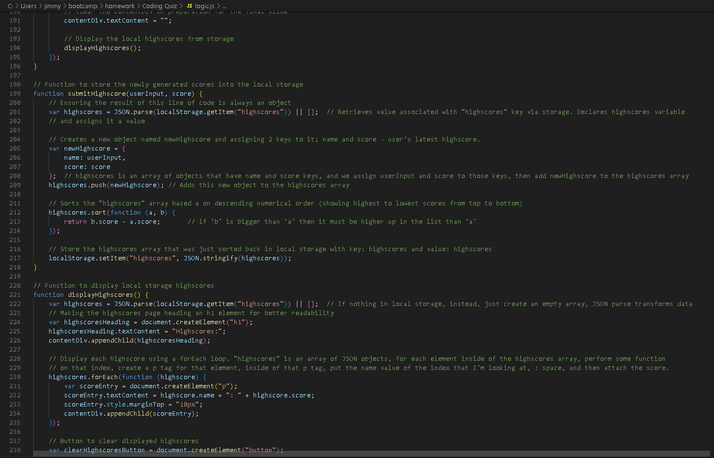
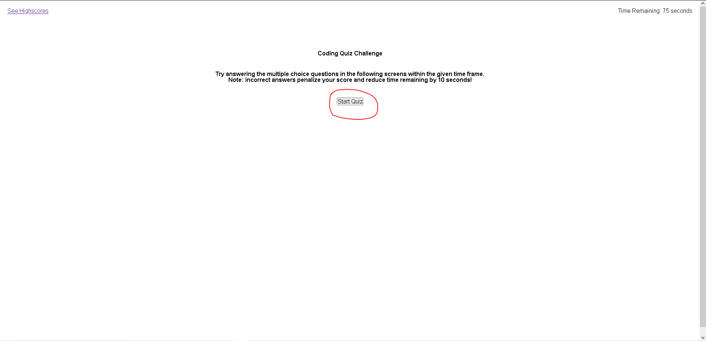

# Coding-Quiz-Game
## Codebase for a dynamic coding quiz game

## Description
The purpose of this project was to create a dynamic JavaScript coding quiz game using weekly learnings from the coding course (refer to index.html and files inside the assets folder for styles). A timed multiple choice coding test was built from scratch to apply the basic JavaScript fundamentals taught in the edX coding bootcamp. Highscores can be kept track of each time the quiz is completed to gauge the user's progress.

## Learnings/takeaways
Takeaways from completing this project include the application of concepts surrounding JavaScript event listeners, as well as JSON parsing and local storages. Understanding how to seamlessly alter HTML elements without directly adding code to the HTML document was a key takeaway from this project as it allowed for a fun and interactive coding quiz to be put together. A functional application was ultimately built by being able to access elements via JavaScript by selecting them using their assigned ID's, as well as being able to execute a dynamically decrementing timer that overarched the quiz. 

        
## Installation
N/A

## Usage 
Go to link: https://jpwu23.github.io/random-password-generator/ Simply click on the "Start Quiz" button to start the game. You will have 75 seconds to complete the test. Begin by answering the multiple choice questions presented on the screen. Each incorrect answer will decrement the timer by 10 seconds. If you run out of time, the quiz will end and you will see your final score. Your score will be displayed at the end of the quiz and you will be asked to submit your name to the high scores list, which will draw from the local storage where it is saved. 

## Credits
ChatGPT, University of Sydney/edX Coding Bootcamp course resources. 

## License
N/A
